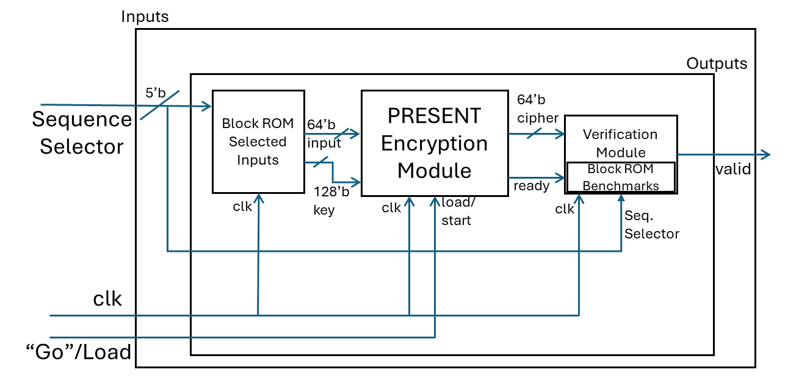

# present_128_verilog
## Verilog PRESENT-128 implementation

Implementation in synthesizable Verilog of PRESENT Block Cipher algorithm in 128-bit. Currently only doing 4 rounds temporarily, but this can be changed by simply altering the round counter condition and generating new test cases for 32 rounds. This change is temporary for use in class assignments.

Controller included for providing a testing apparatus for loaded RAM elements (up to 32 test cases, but can be changed for more).

Scripts for generating test cases provided in ./test_case_generator_py. This will use a python implementation of PRESENT to create 32 unique signatures.

### Block Diagram:

### Expected Simulation Results (Xilinx Vivado Behavioral Simulation Waveform):

Note: Above is based on provided .mem files and controller. The "valid" flag will determine test success.

###Files and Folders:
- imgs -- contains images for READMEs in this repository
- basys3_hw_fpga_config -- Contains the constraints file needed for implementation on Diligent Basys3 FPGA
- test_case_generator_py -- Contains the Py notebook (ipynb) for generating quick and easy PRESENT-128 test mem files
- present.v -- Contains the core PRESENT-128 implementation and module
- controller.v -- Contains the testing apparatus controller and "top module" of this repository
- inputs.mem -- Memory file of 32 192-bit plaintext/key concatenations for PRESENT-128 testing
- benchmarks.mem -- Memory file of 32 64-bit responses from PRESENT-128 test vectors
- README.md -- This file