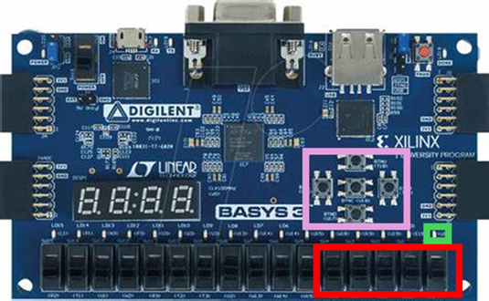

Basys-3-Master.xdc is provided by Diligent, which can be found at the following repository: [Diligent XDC](https://github.com/Digilent/digilent-xdc).

It is modified currently for use with this FPGA design, where:

- Switches {V17,V16,W16,W17,W15} = RAM sequence selector
- LED U16  = Valid/Accepted Solution Out Signal
- Button U18 (btnC) = Signal Load/Start